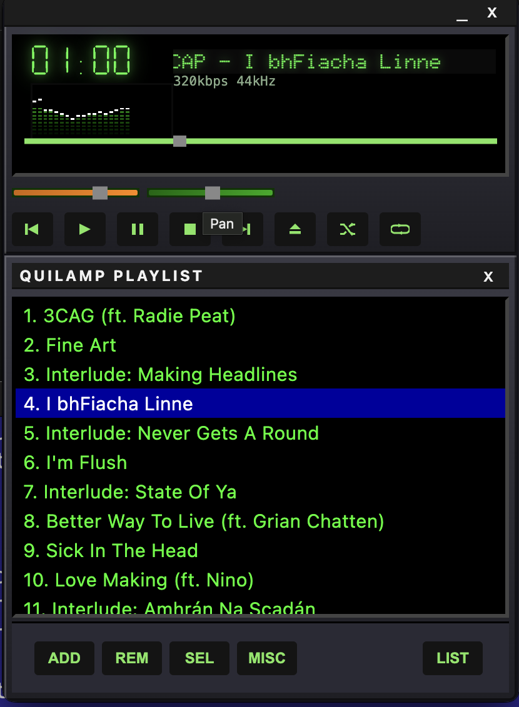
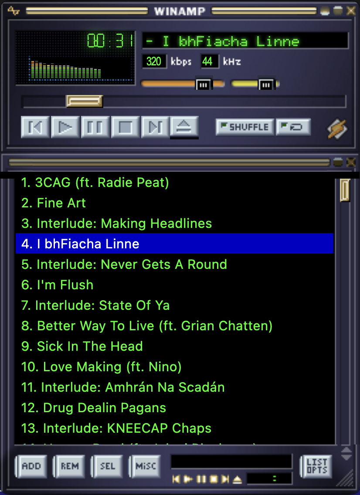

# Quilamp




A modern, cross-platform clone of the classic Winamp media player built with Electron, Vite, and Vanilla JS/CSS. Designed to mimic the iconic late 90s digital interface natively on macOS.

## Features
- **Accurate Classic UI**: Mimics the classic layout (Main player and Playlist window).
- **Core Playback Controls**: Play, Pause, Stop, Previous, Next.
- **Playlist Management**: Eject (Open Dialog) to add `.mp3`, `.wav`, or `.ogg` files or drag & drop files directly onto the player.
- **Volume & Panning**: Volume slider (panning UI included, backend to be expanded).
- **Draggable Frameless Windows**: Fully native feel with invisible borders and a custom draggable titlebar.
- **ProjectM Visualization**: Immersive MilkDrop-compatible visualizer window (powered by [Butterchurn](https://github.com/jberg/butterchurn)).
    - **Controls**:
        - `Space` / `Right Arrow`: Next Preset
        - `Left Arrow`: Previous Preset
        - `L`: Lock/Unlock Preset Rotation

## Quick Start (Development)

Ensure you have [Node.js](https://nodejs.org/) installed, then follow these steps:

1. Navigate to the repository:
   ```bash
   cd quilamp
   ```

2. Install dependencies:
   ```bash
   npm install
   ```

3. Build and Start the application:
   ```bash
   npm run build
   npm start
   ```
   *Note: Using `npm run build` generates the required output in the `build/` directory, while `npm start` launches Electron pointing to that build folder.*

### Live Development (HMR)

To make changes to CSS or JS and see them immediately:

1. In one terminal, start the Vite dev server:
   ```bash
   npm run dev
   ```

2. In a second terminal, launch Electron in dev mode:
   ```bash
   npx electron .
   ```
   The app will automatically connect to `localhost:5173` and reload whenever you save a file.

## Building / Packaging (macOS)

To build a distributable macOS Application (`.app` and `.dmg`), run the following command:

```bash
npm run dist
```

After the build completes, look in the `dist/` directory for the `Quilamp-1.1.0-mac.zip` or `Quilamp-1.1.0.dmg`. Build uses standard `electron-builder` Mac templates.

## Built With
- **Electron**
- **Vite**
- **Butterchurn** (MilkDrop 2 WebGL implementation)
- **Vanilla web tech**