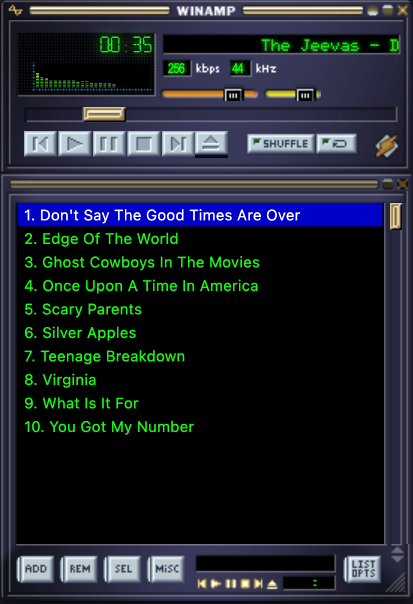

# Quilamp

A modern, cross-platform clone of the classic Winamp media player built with Electron, Vite, and Vanilla JS/CSS. Designed to mimic the iconic late 90s interface.

## Features
- **Modern UI**: Clean, modern interface with a dark theme inspired by the classic Winamp UI.
- **Classic UI**: The original Winamp 2.x UI, with the classic layout is available as a skin.
- **Skins**: Supports loading Winamp 2.x skins. (Mostly)
- **Playlist Management**: Eject (Open Dialog) to add `.mp3`, `.wav`, or `.ogg` files or drag & drop files directly onto the player.
- **ProjectM Visualization**: Immersive MilkDrop-compatible visualizer window (powered by [Butterchurn](https://github.com/jberg/butterchurn)).
    - **Controls**:
        - `Space` / `Right Arrow`: Next Preset
        - `Left Arrow`: Previous Preset
        - `L`: Lock/Unlock Preset Rotation

## Screenshots

## Installation
Go to the latest release page [here](https://github.com/batgranny/quilamp/releases) and download the version for your computer:
- **macOS (Apple Silicon - M1/M2/M3)**: `Quilamp-1.2.1-arm64.dmg`
- **macOS (Intel)**: `Quilamp-1.2.1.dmg`
- **Windows**: `Quilamp Setup 1.2.1.exe`

Double click to install.

> [!IMPORTANT]
> **macOS Users**: Since this application is currently unsigned, you may see a message stating that the app is "damaged" or from an unidentified developer. Please see the [Troubleshooting](#troubleshooting-macos) section below for the fix (no terminal required!).

## Troubleshooting (macOS)
If you see a message stating the app is **"damaged"** or **"can't be opened because it is from an unidentified developer"**, follow these simple steps (no Terminal needed):

### Method 1: The Right-Click Shortcut (Fastest)
1. Locate **Quilamp** in your `Applications` folder.
2. **Right-click** (or Control-click) the app icon and select **Open**.
3. A dialog will appear asking if you're sure. Click **Open**.
   *Note: You only need to do this once.*

### Method 2: System Settings
1. Try to open the app normally so the error appears, then click **OK**.
2. Open **System Settings** (or System Preferences) on your Mac.
3. Navigate to **Privacy & Security**.
4. Scroll down to the **Security** section where you see a message about **"Quilamp" was blocked...**.
5. Click the **Open Anyway** button.
6. Enter your password and confirm by clicking **Open**.
